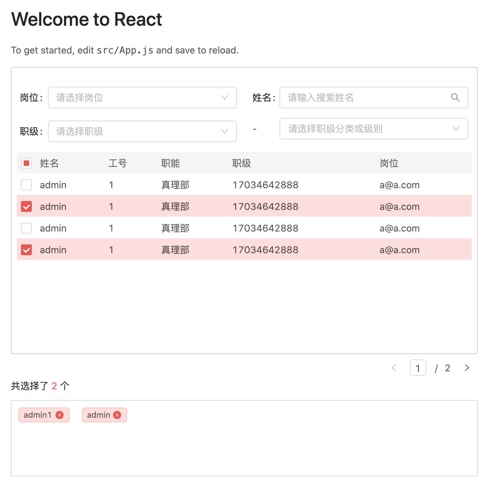

# infinitus-custom-contacts
infinitus-custom-contacts


[](https://github.com/vkingw/custom-contacts)
[](https://www.npmjs.com/package/infinitus-custom-contacts)
[](https://www.npmjs.com/package/infinitus-custom-contacts)

## 示例图片



## 如何使用

### 安装

`yarn add infinitus-react-contacts`

### React 

```js
import Contacts from 'infinitus-custom-contacts';

<Contacts {...props}/>

```

属性  | 描述 | 类型 | 默认值
------------- | ------------- | --------------| ------------- 
loading | 加载状态 | bool | false
searchResult | 用户查询结果 （[数据](###用户和搜索结果数据)） | object | { records: []}
handleSearchUser | 搜索用户和反应回调 | func | function(page, jobs, name, rank, rankClassification), page:Number  jobs:obj  name:String rank:obj rankClassification:obj
updateSelectUsers | 更新选定用户数据 | func | function(userSelected)
defaultUserSelected   | 默认选择用户 | array | [{id:'abc',name:'CCC'}] 
numberColor   | 选择的总数字颜色 | sring | #1B9AFF 
totalShowText   | 选择的总数文字 | string | 共选择了$个 
jobsText   | 岗位显示名称 | string | '岗位' 
nameText   | 姓名显示名称 | string | '姓名' 
rankText   | 职级显示名称 | string | '职级' 
workNumberNumber   | 工号显示名称 | string | '工号' 
functionText   | 岗位显示名称 | string | '岗位' 
namePlaceholder   | 姓名输入提示 | string | '请输入搜索姓名' 
jobsPlaceholder   | 岗位输入提示 | string | '请选择岗位' 
rankPlaceholder   | 职级输入提示 | string | '请选择职级' 
rankTipPlaceholder   | 职级分类或级别输入提示 | string | '请选择职级分类或级别' 
jobsData   | 岗位下拉框数据 | string | [] 
jobsValueKey   | 岗位下拉框数据key名称 | string | 'id' 
jobsNameKey   | 岗位下拉框数据显示名称的key | string | 'name' 
rankData   | 职级下拉框数据 | string | [] 
rankValueKey   | 职级下拉框数据key的名称 | string | 'id' 
rankNameKey   | 职级下拉框数据显示名称的key | string | 'name' 
rankClassificationData   | 职级分类或级别数据 | string | [] 
rankClassificationValueKey   | 职级分类或级别key的名称 | string | 'id' 
rankClassificationNameKey   | 职级分类或级别显示名称的key | string | 'name'
tableColumnsKey   | 查询结果table columns 对应 dataIndex,请注意第一个name和数据回显也对应 | array |  ['name', 'workNumberNumber', 'fun', 'rank', 'jobs'],
tableRowKey   | table row key，此值和数据回显也对应 | string | 'id' 
emptyTip   | table 空数据提示 | string | '什么都没有哦~'
tableCheckboxDisabled   | table中需要禁止选择的key的集合 | array | []

### 职级分类或级别数据结构

````
[
      {
        id: 1,
        parentId: 0,
        children: [
          {
            id: 3,
            parentId: 1,
            children: [
              {
                id: 4,
                parentId: 3,
                children: [
                  {
                    id: 5,
                    parentId: 4,
                    children: [],
                    name: '院校农信',
                  },
                ],
                name: '高新农信',
              },
            ],
            name: '潍坊农信',
          },
        ],
        name: '山东农信',
      },
  ]
````

### 用户和搜索结果数据

const columns = [
    {
      title: nameText,
      dataIndex: 'name',
    },
    {
      title: workNumberNumber,
      dataIndex: 'workNumberNumber',
    },
    {
      title: functionText,
      dataIndex: 'fun',
    },
    {
      title: rankText,
      dataIndex: 'rank',
    }, {
      title: jobsText,
      dataIndex: 'jobs',
    }
  ];

```

 {
      records: [
        {
          id: 1,
          name:'abc',
          workNumberNumber:12,
          fun:'aaa',
          rank:'bbb',
          jobs:'ttt' 
        },
	   ......
      ],
      total: 11,
      size: 10,
      current: 1,
      searchCount: true,
      pages: 1,
    },

```

### 开发

````
$ git clone https://github.com/wafersystems/react-contacts.git
$ yarn
$ yarn start

````
